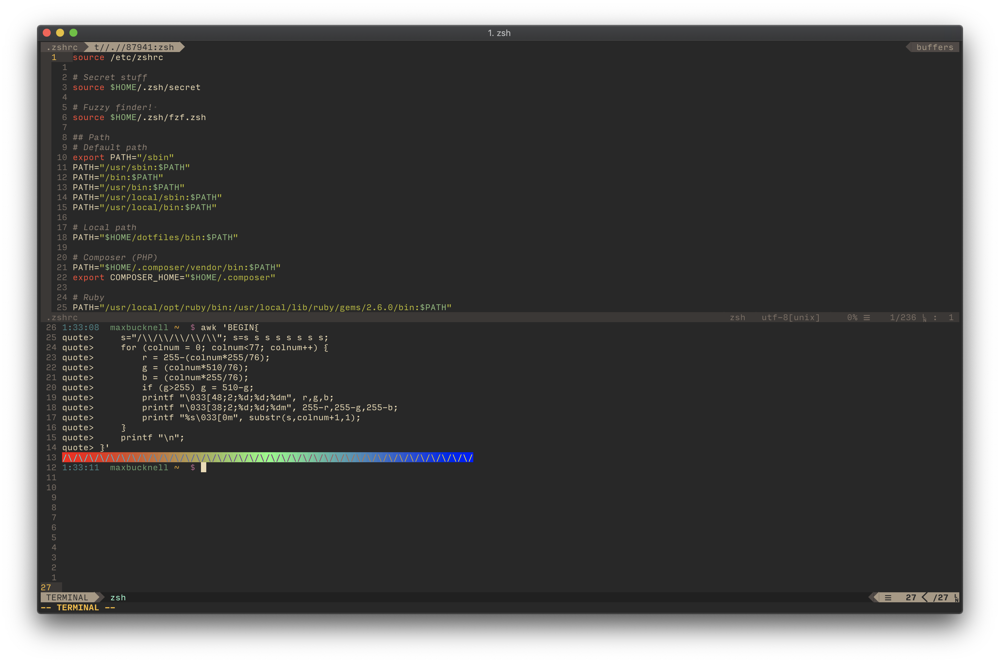

# Dotfiles

There are many like them, but these are mine.

The configuration files here are in various states of disrepair. Right now, I'm
maintaining:

+ Zshell
+ Neovim

In addition to this, you can find a few little scripts I use in the `bin`
directory.
